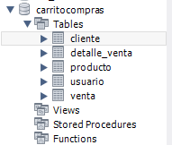
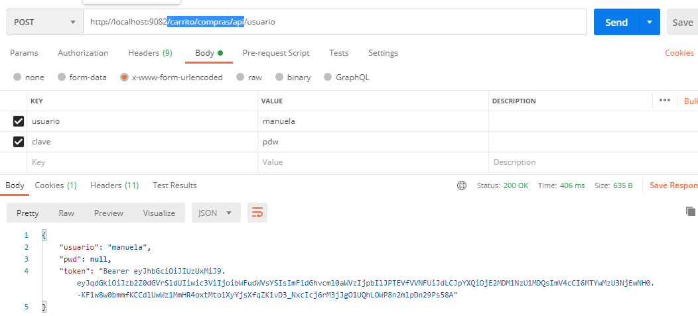
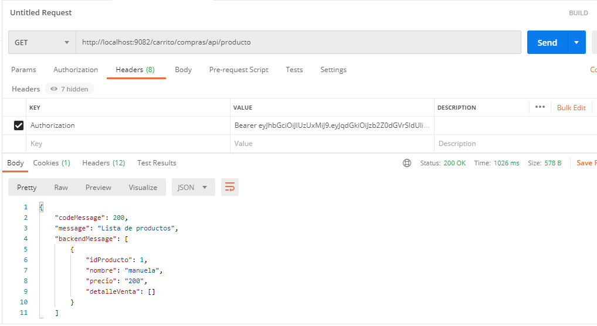
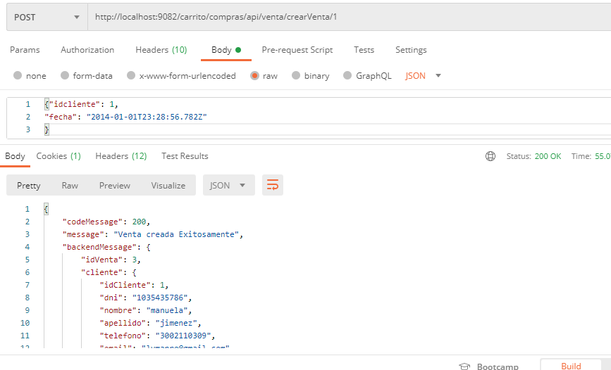
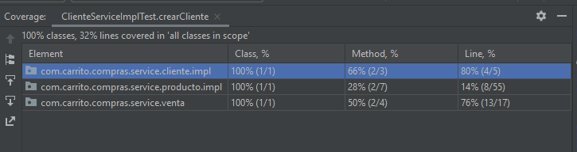
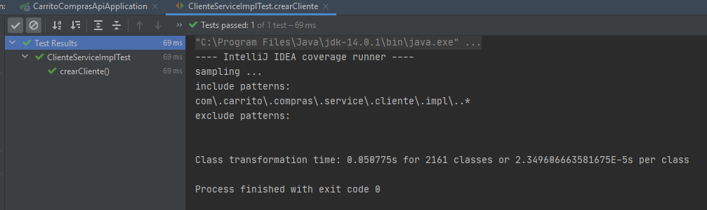
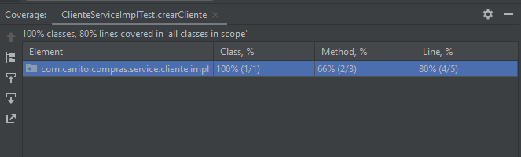
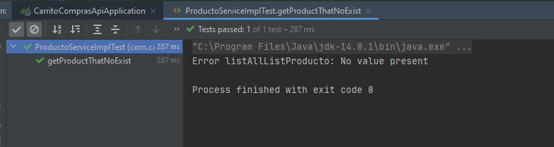
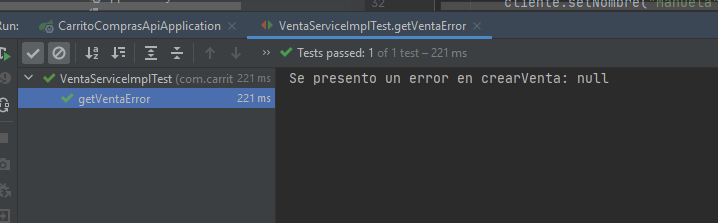

# Proyecto carrito de compras #

Se debe ejecutar, normal sin docker, al compilar el proyecto se debe crear el scrit en la bd Mysql, para insertar un nuevo usuario.
INSERT INTO `carritocompras`.`usuario` (`id`, `usuario`) VALUES ('1', 'admin');

Se debe generar el enpoint para conocer el token de la siguiente manera.

Luego llama al siguiente Enpoint enviando en el nuevo token generado, al igual que los demas enpoint.

# Ejecucion de pruebas unitarias #

Prueba Crear cliente exitosa

Caso de prueba error de producto

Caso de prueba error para venta

